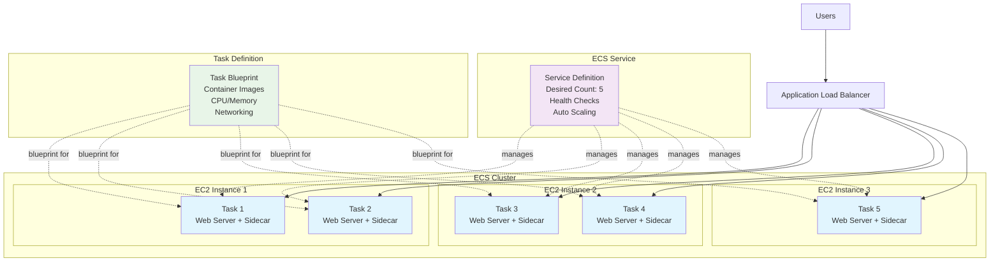

# Docker Containers: Bare EC2 vs ECS Comparison

## Benefits Comparison: Bare EC2 vs ECS

### Running Docker Containers on Bare EC2 Instances

**Benefits:**
- **Full control**: Complete control over the underlying infrastructure, operating system, and Docker configuration
- **Flexibility**: Can customize the entire stack according to specific requirements
- **Cost predictability**: Direct EC2 pricing without additional orchestration layer costs
- **Existing expertise**: Teams familiar with traditional server management can leverage existing skills

**Challenges:**
- **Manual management**: You're responsible for container orchestration, scaling, health checks, and service discovery
- **Operational overhead**: Need to manage patching, monitoring, logging, and security updates
- **Complexity**: Implementing high availability, load balancing, and auto-scaling requires significant effort
- **No native AWS integration**: Limited built-in integration with other AWS services

### Running Docker Containers on ECS

**Benefits:**
- **Fully managed orchestration**: AWS handles container scheduling, placement, and health management
- **Native AWS integration**: Seamless integration with IAM, CloudWatch, Application Load Balancer, and other AWS services
- **Simplified scaling**: Built-in auto-scaling capabilities for both containers and underlying infrastructure
- **Multiple compute options**: Can use EC2 instances or AWS Fargate (serverless containers)
- **Service discovery**: Built-in service discovery and load balancing
- **Security**: Enhanced security with IAM roles for tasks and VPC networking
- **Monitoring and logging**: Integrated CloudWatch metrics and logging
- **High availability**: Automatic distribution across multiple Availability Zones

## Key ECS Concepts

### ECS Cluster
An **ECS Cluster** is a logical grouping of compute resources (EC2 instances or Fargate capacity) where you run your containerized applications. Think of it as the foundation or infrastructure layer that provides the compute capacity for your containers.

**Key characteristics:**
- Can span multiple Availability Zones for high availability
- Can use EC2 instances, Fargate, or both as compute capacity
- Provides the underlying infrastructure for running tasks and services

### ECS Task
An **ECS Task** is the instantiation of a task definition - it's a running set of containers based on the blueprint defined in the task definition. A task represents the smallest deployable unit in ECS.

**Key characteristics:**
- Contains one or more containers that are scheduled together on the same host
- Containers within a task can communicate using localhost (when using awsvpc network mode)
- Has its own lifecycle - it can be started, stopped, or replaced
- Gets assigned resources (CPU, memory) as defined in the task definition

### ECS Service
An **ECS Service** ensures that a specified number of tasks are running and healthy at all times. It's the orchestration layer that manages the desired state of your application.

**Key characteristics:**
- Maintains the desired number of running tasks
- Automatically replaces unhealthy tasks
- Integrates with load balancers for traffic distribution
- Handles rolling deployments and updates
- Can automatically scale based on metrics
- Provides service discovery capabilities

## Relationship Between These Concepts

The relationship flows like this:

1. **Cluster** provides the compute infrastructure
2. **Task Definition** serves as the blueprint (specifies which containers to run, resource requirements, networking, etc.)
3. **Task** is a running instance of that blueprint
4. **Service** manages multiple tasks to ensure your application stays running and healthy

### Example Architecture

For example, you might have:
- A cluster with 3 EC2 instances
- A service that maintains 5 running tasks of your web application
- Each task runs 2 containers (web server + sidecar)
- The service ensures if any task fails, it's automatically replaced

This architecture provides the benefits of containerization while removing much of the operational complexity you'd face when managing Docker containers directly on EC2 instances.

