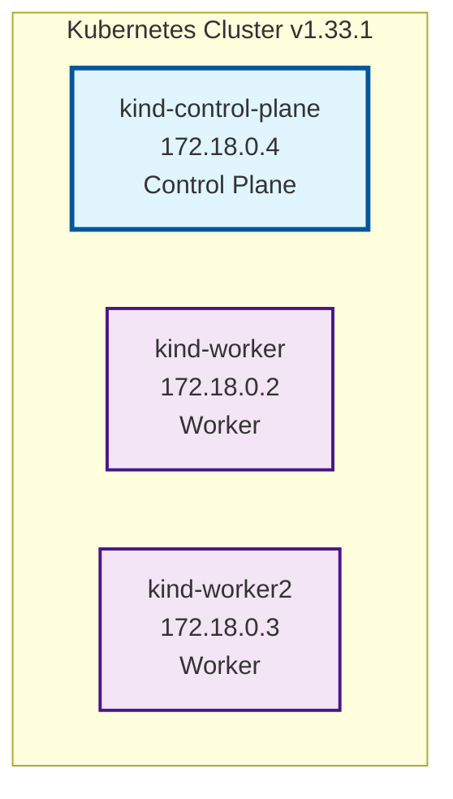
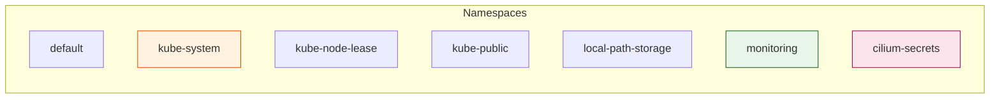
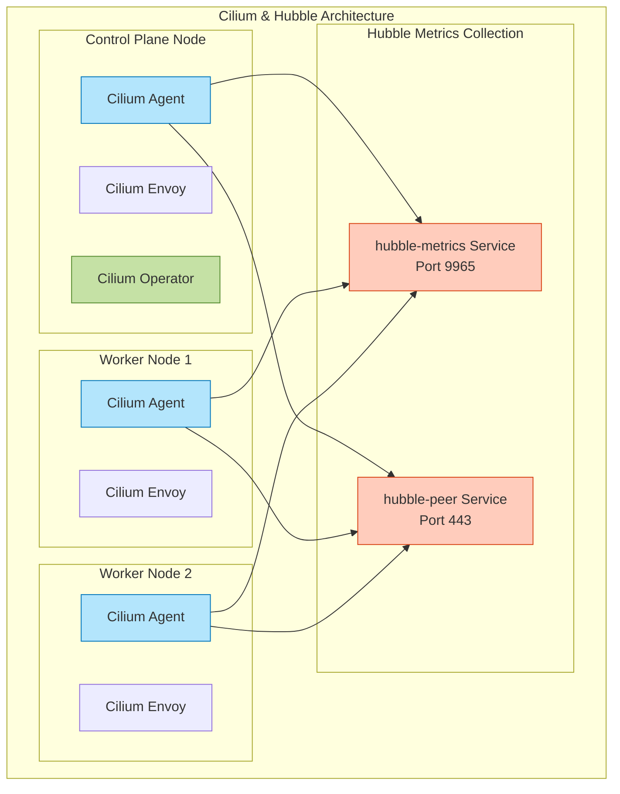
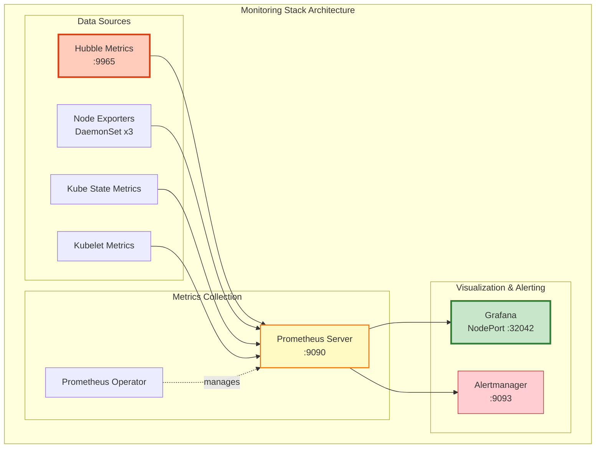
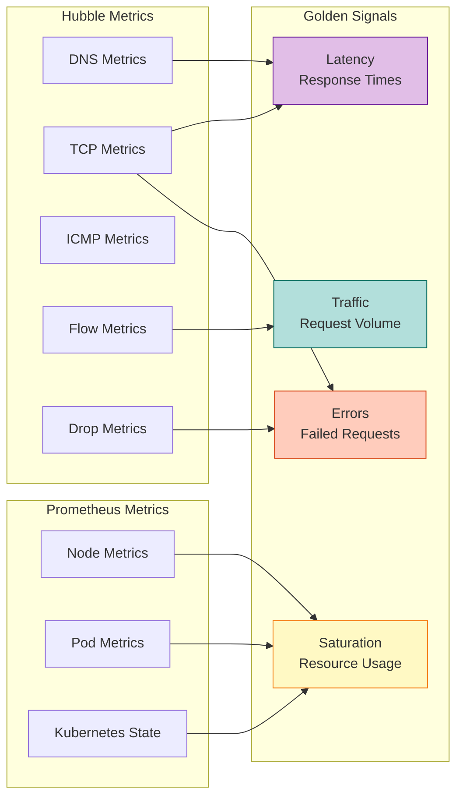
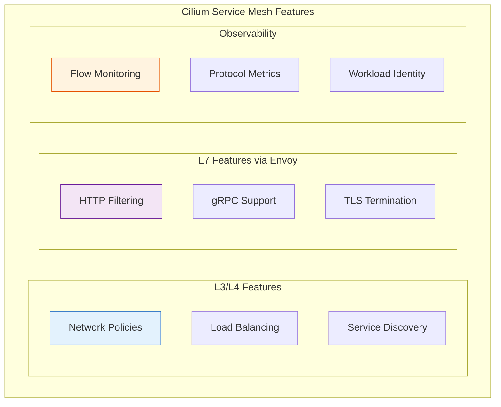
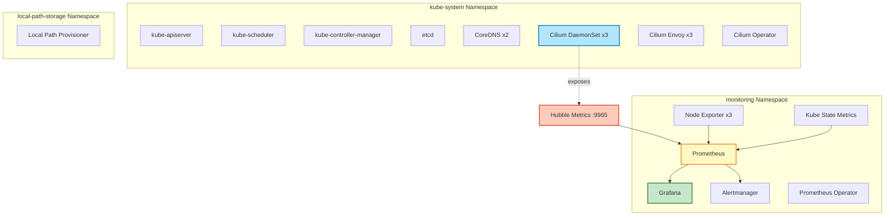

# Golden Signals with Hubble and Grafana

## Cluster Overview

This document provides a comprehensive analysis of the Kubernetes cluster, focusing on observability through Hubble and Grafana for monitoring Golden Signals (Latency, Traffic, Errors, and Saturation).

### Cluster Facts

**Kubernetes Version:** v1.33.1

**Node Count:** 3 nodes
- 1 control-plane node
- 2 worker nodes

**Container Runtime:** containerd 2.1.1

**Operating System:** Debian GNU/Linux 12 (bookworm)

**Kernel Version:** 6.14.0-1015-gcp

**Cluster Type:** kind (Kubernetes in Docker)

### Node Details

### Resource Summary

| Resource Type | Count |
|--------------|-------|
| Namespaces | 7 |
| Pods | 25 |
| Deployments | 6 |
| DaemonSets | 3 |
| Services | 16 |

### Namespaces

## Cilium and Hubble Configuration

### Cilium Installation

**Status:** ✅ Installed and Running

**Version:** 1.17.4

**Components:**
- Cilium Agent (DaemonSet): 3 pods running
- Cilium Envoy (DaemonSet): 3 pods running
- Cilium Operator (Deployment): 1 pod running

### Hubble Configuration

**Status:** ✅ Enabled and Operational

**Key Features:**
- Hubble metrics enabled
- Hubble Open Metrics enabled
- Current/Max Flows: 3433/4095 (83.83%)
- Flows/s: 12.86
- Metrics Status: Ok

**Hubble Metrics Exposed:**
- DNS metrics
- Drop metrics
- TCP metrics
- ICMP metrics
- Flow metrics with workload context

**Hubble Metrics Server:** Port 9965 (ClusterIP service: hubble-metrics)

**Note:** Hubble Relay is not deployed in this cluster. Metrics are exposed directly from Cilium agents.

## Monitoring Stack

### Prometheus and Grafana Setup

**Status:** ✅ Fully Deployed

The cluster has a complete monitoring stack deployed in the `monitoring` namespace:

**Components:**

1. **Grafana**
   - Deployment: prometheus-grafana
   - Service: NodePort on port 32042
   - Pods: 1 running (3 containers)

2. **Prometheus**
   - Operator: prometheus-k8s-operator
   - Prometheus Server: prometheus-k8s-prometheus-0 (StatefulSet)
   - Service: prometheus-k8s-prometheus (Port 9090)

3. **Alertmanager**
   - StatefulSet: alertmanager-prometheus-k8s-alertmanager-0
   - Service: prometheus-k8s-alertmanager (Port 9093)

4. **Exporters**
   - Node Exporter (DaemonSet): 3 pods running
   - Kube State Metrics: 1 pod running

## Golden Signals Monitoring

The cluster is configured to monitor the four Golden Signals through Hubble and Prometheus/Grafana:

### 1. Latency

**Measured by:**
- Hubble TCP metrics (connection establishment, RTT)
- Hubble DNS metrics (query response times)
- Flow metrics with timing information

### 2. Traffic

**Measured by:**
- Hubble flow metrics (flows/second: 12.86)
- Flow context with workload names
- Source and destination identity tracking

### 3. Errors

**Measured by:**
- Hubble drop metrics (packet drops)
- DNS failure metrics
- TCP connection failures
- ICMP error messages

### 4. Saturation

**Measured by:**
- Hubble flow capacity: 3433/4095 (83.83% utilized)
- Node exporter metrics (CPU, memory, disk, network)
- Kube state metrics (pod resource requests/limits)

## Cluster Characteristics

### Key Distinguishing Features

1. **CNI Solution:** Cilium 1.17.4 with eBPF-based networking
   - Advanced network observability through Hubble
   - Envoy proxy integration for L7 visibility
   - Native support for network policies

2. **Observability Stack:** Complete monitoring solution
   - Prometheus Operator for metrics collection
   - Grafana for visualization (accessible via NodePort 32042)
   - Alertmanager for alert management
   - Hubble metrics integration for network observability

3. **Development Environment:** kind cluster
   - Lightweight, containerized Kubernetes
   - Suitable for local development and testing
   - Multi-node setup (1 control-plane + 2 workers)

4. **Modern Kubernetes:** Running v1.33.1
   - Latest stable release
   - containerd runtime
   - Debian-based nodes

5. **Network Observability:** Hubble enabled
   - Real-time flow monitoring
   - Protocol-level metrics (DNS, TCP, ICMP)
   - Workload identity tracking
   - High flow utilization (83.83%)

### Service Mesh Capabilities

## Deployment Architecture

## Access Information

### Grafana Dashboard
- **Service Type:** NodePort
- **Port:** 32042
- **Access:** `http://<node-ip>:32042`

### Prometheus
- **Service:** prometheus-k8s-prometheus
- **Port:** 9090
- **Type:** ClusterIP

### Hubble Metrics
- **Service:** hubble-metrics
- **Port:** 9965
- **Type:** ClusterIP (headless)

## Summary

This is a well-configured Kubernetes cluster optimized for observability and network monitoring:

- **3-node kind cluster** running Kubernetes v1.33.1
- **Cilium 1.17.4** providing advanced networking with eBPF
- **Hubble enabled** for deep network observability with 83.83% flow utilization
- **Complete Prometheus/Grafana stack** for metrics collection and visualization
- **Golden Signals monitoring** through Hubble metrics (latency, traffic, errors, saturation)
- **25 pods** across 7 namespaces supporting core services and monitoring
- **NodePort access** to Grafana on port 32042 for easy dashboard access

The cluster is production-ready from an observability standpoint, with comprehensive monitoring of both infrastructure and network layers.
