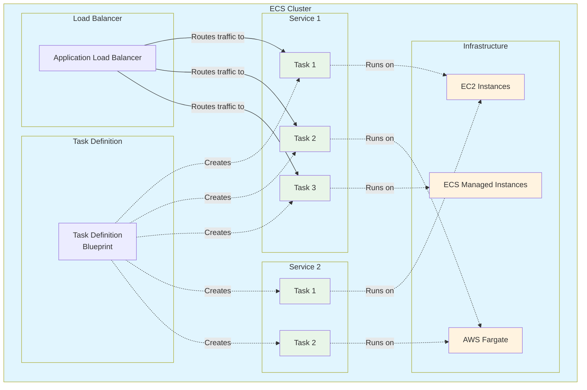

# DSS-20251202

ECS cluster architecture example:

```mermaid
graph TB
    subgraph "ECS Cluster"
        subgraph "Infrastructure"
            EC2[EC2 Instances]
            Fargate[AWS Fargate]
            Managed[ECS Managed Instances]
        end
        
        subgraph "Service 1"
            S1_T1[Task 1]
            S1_T2[Task 2]
            S1_T3[Task 3]
        end
        
        subgraph "Service 2"
            S2_T1[Task 1]
            S2_T2[Task 2]
        end
        
        subgraph "Task Definition"
            TD[Task Definition<br/>Blueprint]
        end
        
        subgraph "Load Balancer"
            ALB[Application Load Balancer]
        end
    end
    
    %% Relationships
    TD -.->|Creates| S1_T1
    TD -.->|Creates| S1_T2
    TD -.->|Creates| S1_T3
    TD -.->|Creates| S2_T1
    TD -.->|Creates| S2_T2
    
    ALB -->|Routes traffic to| S1_T1
    ALB -->|Routes traffic to| S1_T2
    ALB -->|Routes traffic to| S1_T3
    
    S1_T1 -.->|Runs on| EC2
    S1_T2 -.->|Runs on| Fargate
    S1_T3 -.->|Runs on| Managed
    S2_T1 -.->|Runs on| EC2
    S2_T2 -.->|Runs on| Fargate
    
    %% Styling
    classDef cluster fill:#e1f5fe
    classDef service fill:#f3e5f5
    classDef task fill:#e8f5e8
    classDef infra fill:#fff3e0
    
    class EC2,Fargate,Managed infra
    class S1_T1,S1_T2,S1_T3,S2_T1,S2_T2 task
```
